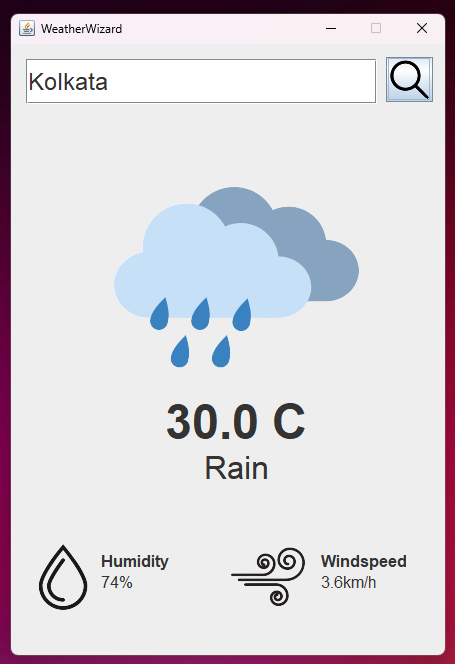
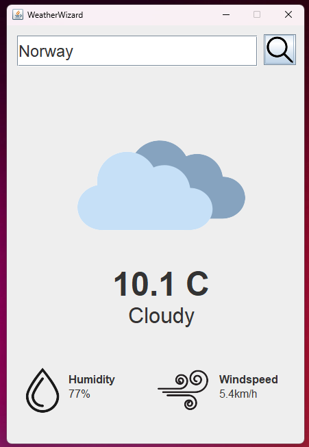

# WeatherWizard

Welcome to WeatherApp, a sleek and intuitive weather application built with Java Swing! With WeatherApp, you can effortlessly check the latest weather conditions for any location around the world right from your desktop.

## Features

- **Real-time Weather Data**: Get access to up-to-date weather information sourced from reliable APIs.
- **Search by Location**: Easily search for weather updates by entering the name of your desired location.

## Screenshots

*Caption: WeatherApp's sleek and intuitive interface allows you to quickly check the weather for any location.*

*Caption: Search for weather updates by entering the name of your desired location.*

## Installation

To run WeatherApp locally on your machine, follow these simple steps:

1. Clone this repository to your local machine using `https://github.com/N-Thander/WeatherWizard.git`.
2. Navigate to the project directory: `cd WeatherApp`.
3. Compile the Java source files: `javac *.java`.
4. Run the WeatherApp application: `java AppLauncher`.

## Dependencies

WeatherApp relies on the following libraries:

- **Swing Framework**: Java Swing provides the foundation for building the graphical user interface.
- **JSON.simple**: JSON.simple is used for parsing JSON data retrieved from weather APIs.

## Usage

1. Launch the WeatherApp application by running the `AppLauncher` class.
2. Enter the name of the location you want to check the weather for in the search bar.
3. Press the "Search" button or hit Enter to retrieve the latest weather information.
4. Also shows additional details like "Humidity" and "WindSpeed"

